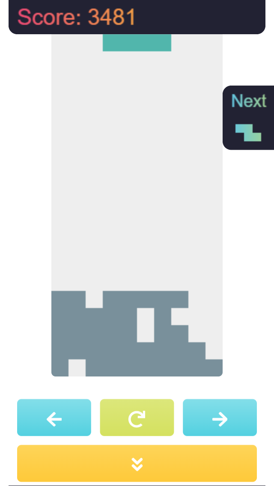

# Simple Tetris

No frameworks or libraries are used. Just plain JavaScript. Built with snowpack

<div style="text-align: center;">
  
</div>

## Installation

```bash
npm i
```

## Running

Use [npm](https://www.npmjs.com/) to build and [http-server](https://www.npmjs.com/package/http-server#running-on-demand) to serve project:

```
npm run build
npx http-server build
```

...and then open http://localhost:8080/

...or maybe open on [codesandbox](https://codesandbox.io/s/github/dyefim/vanillajs-canvas-tetris)
